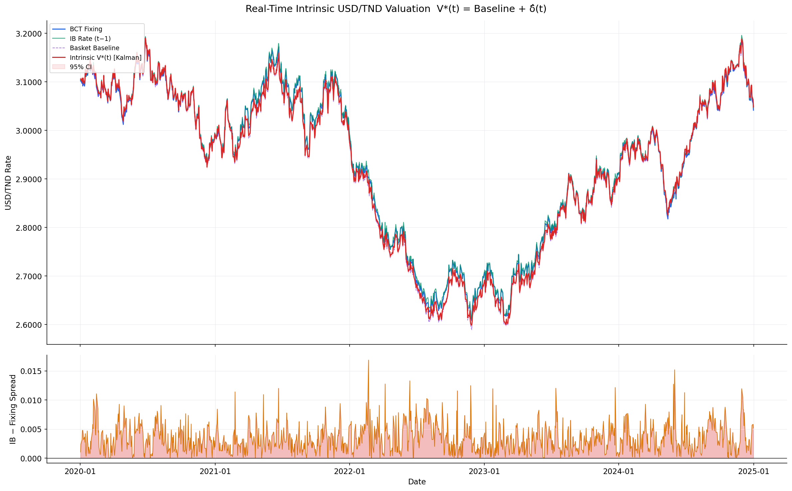
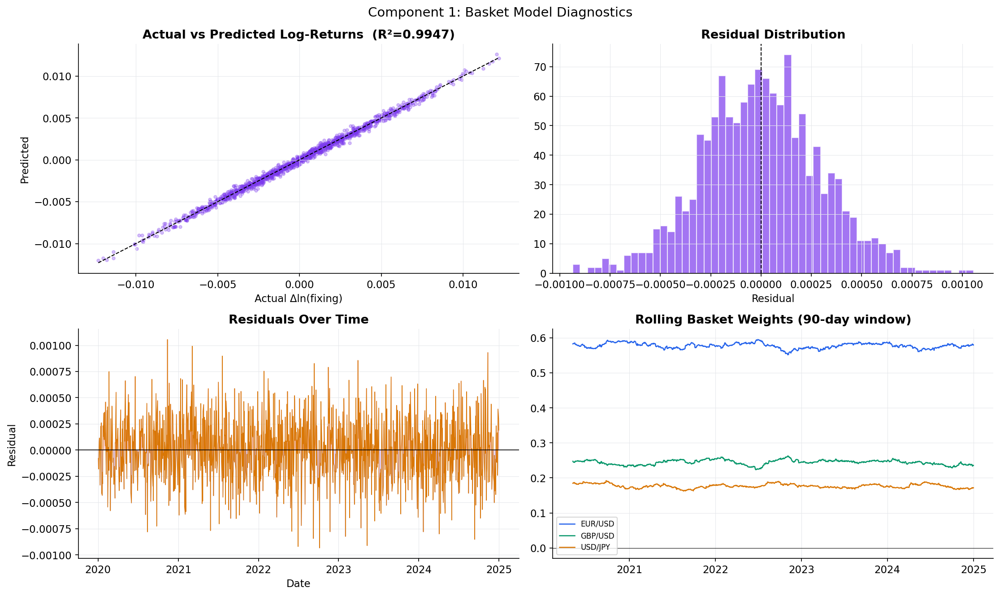
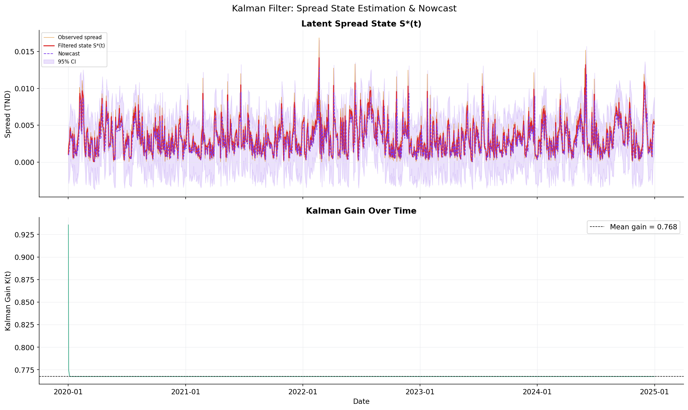
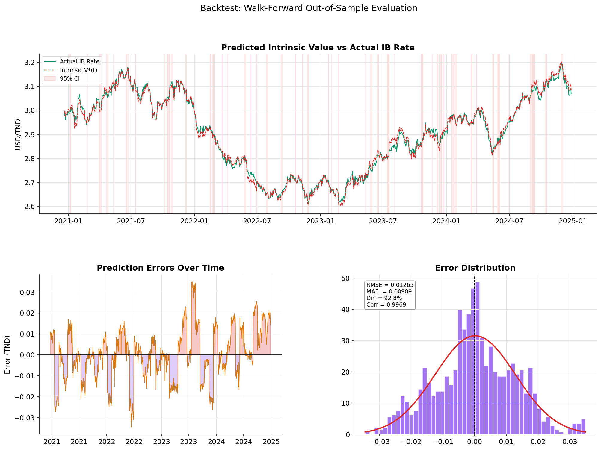

# TND Intrinsic Value Model

**Real-Time Intrinsic USD/TND Valuation Model**  
FIN 460 – Dynamic Asset Pricing Theory · Tunis Business School

[](https://www.python.org/)
[](LICENSE)
[]()

---

## Overview

This project delivers a **continuously updating fair-value estimate** for the USD/TND exchange rate by combining two components:

1. **Basket-Based Baseline** — links movements in EUR/USD, GBP/USD, and USD/JPY to the BCT official fixing via a weighted regression, producing an intrinsic rate assuming no local frictions.
2. **Stochastic Liquidity Adjustment** — models the deviation between the interbank (IB) rate and the fixing using an Ornstein-Uhlenbeck process, a Kalman filter (primary), and an Error-Correction Model (ECM). Handles the BCT's one-day IB publication lag via nowcasting.

The combined output:

```
V*(t) = f(fixing_anchor, ΔFXEUR, ΔFXGBP, ΔFXJPY) + δ̂(t)
```

provides a real-time intrinsic USD/TND rate that accounts for both global currency fundamentals and local Tunisian FX liquidity conditions.

---

## Results (synthetic data validation)

| Metric | Value |
|---|---|
| Basket R² | 0.9947 |
| Estimated weights | EUR=0.578, GBP=0.244, JPY=0.178 |
| OOS RMSE (Kalman) | 0.01265 TND |
| Directional accuracy | 92.8% |
| Corr(V\*, IB rate) | 0.9969 |

### Key charts

<table>
<tr>
<td><br><sub>Intrinsic value vs BCT fixing & IB rate</sub></td>
<td><br><sub>Basket model diagnostics</sub></td>
</tr>
<tr>
<td><br><sub>Kalman filter state estimation</sub></td>
<td><br><sub>Walk-forward backtest results</sub></td>
</tr>
</table>

---

## Repository structure

```
tnd-intrinsic-value-model/
│
├── README.md
├── LICENSE
├── requirements.txt              # pip dependencies
├── .gitignore
│
├── run_standalone.py             # ← START HERE: self-contained demo (no yfinance needed)
├── main.py                       # Full pipeline with CLI flags
│
├── data/
│   ├── __init__.py
│   ├── loader.py                 # Data ingestion: FX rates + BCT fixing + IB rates
│   ├── bct_fixing.csv            # ← ADD YOUR DATA HERE (template included)
│   └── bct_interbank.csv         # ← ADD YOUR DATA HERE (template included)
│
├── models/
│   ├── __init__.py
│   ├── basket.py                 # Component 1: basket weight estimation (OLS)
│   ├── liquidity.py              # Component 2: OU, Kalman filter, ECM
│   └── realtime.py               # Real-time engine combining both components
│
├── backtest/
│   ├── __init__.py
│   └── engine.py                 # Walk-forward backtest + model comparison
│
├── utils/
│   ├── __init__.py
│   └── visualize.py              # All charts (6 figures)
│
├── notebooks/
│   └── exploration.ipynb         # Interactive analysis notebook
│
└── output/                       # Generated figures and Excel report
    ├── 01_basket_diagnostics.png
    ├── 02_spread_analysis.png
    ├── 03_kalman_filter.png
    ├── 04_intrinsic_value.png
    ├── 05_backtest_performance.png
    ├── 06_model_comparison.png
    └── tnd_intrinsic_model_results.xlsx
```

---

## Quickstart

### 1. Clone and install

```bash
git clone https://github.com/YOUR_USERNAME/tnd-intrinsic-value-model.git
cd tnd-intrinsic-value-model
pip install -r requirements.txt
```

### 2. Run the self-contained demo (no external data needed)

```bash
python run_standalone.py
```

This generates all charts and the Excel report in `output/` using **synthetic but realistic** USD/TND data. The synthetic data is calibrated to match observed TND dynamics (OU spread, basket structure, occasional liquidity spikes).

### 3. Run with real BCT data

Drop your CSV files into `data/`:

**`data/bct_fixing.csv`**
```csv
date,session,rate
2020-01-02,morning,3.1020
2020-01-02,evening,3.1045
2020-01-03,morning,3.1015
...
```

**`data/bct_interbank.csv`**
```csv
date,ib_rate
2020-01-02,3.1035
2020-01-03,3.1028
...
```

> **Note:** The IB rate published by the BCT on date `t` reflects interbank activity on date `t-1`. The model handles this lag automatically.

Then run:

```bash
python main.py --start 2020-01-01 --end 2024-12-31 --session morning
```

### CLI options

```
python main.py [OPTIONS]

Options:
  --start TEXT         Start date for data (default: 2020-01-01)
  --end TEXT           End date for data   (default: 2024-12-31)
  --session TEXT       BCT session to use as anchor: morning | evening
  --no-backtest        Skip walk-forward backtest (faster)
  --live               Run live simulation demo after fitting
  --output-dir TEXT    Output directory    (default: output)
```

---

## Model architecture

### Component 1 — Basket baseline

Estimates the sensitivity of USD/TND to global FX movements via OLS on log-returns:

```
Δln(fixing_t) = α + w₁·Δln(EURUSD_t) + w₂·Δln(GBPUSD_t) + w₃·Δln(USDJPY_t) + εt
```

Features:
- HAC-robust standard errors (Newey-West, 5 lags)
- Optional constrained OLS (w₁+w₂+w₃=1)
- 90-day rolling weights to detect parameter instability
- Full diagnostic suite: R², Durbin-Watson, residual ACF

The real-time baseline at intraday moment `t`:

```
baseline(t) = fixing_anchor × exp( Σᵢ wᵢ · Δln(FXᵢ,t / FXᵢ,anchor) )
```

### Component 2 — Stochastic liquidity adjustment

Three nested models for the spread `S(t) = IB(t) − fixing(t)`:

#### Ornstein-Uhlenbeck (parametric)
```
dS = θ(μ − S)dt + σ dW
```
Parameters estimated via exact MLE. One-step-ahead forecast:
```
E[S(t)|S(t-1)] = μ + e^{-θ}(S(t-1) − μ)
```

#### Kalman filter (primary — recommended)
State-space model explicitly handling the t-1 observation lag:
```
State:       S*(t) = φ·S*(t-1) + η_t     η ~ N(0, Q)
Observation: S_obs(t-1) = S*(t-1) + ε_t  ε ~ N(0, R)
```
Parameters φ, Q, R estimated via the EM algorithm (RTS smoother in the E-step). Intraday signals (indicative bank quotes) are incorporated via standard Kalman update equations.

#### Error-Correction Model
VECM on [IB_rate, fixing], exploiting the long-run cointegrating relationship. The ECM term captures the structural mean-reversion force.

### Real-time combination
```
V*(t) = baseline(t) + δ̂(t)
```
where `δ̂(t)` is the Kalman posterior mean of the spread, updated on each FX tick and each intraday signal.

---

## Backtesting methodology

Walk-forward expanding-window backtest:
- Initial training window: 252 business days (1 year)
- Step size: 21 days (1 month)
- At each step: re-fit basket model and Kalman filter on expanding history; predict next 21 days

Ground truth: next-day published IB rate (best available proxy for realised market rate).

Performance metrics computed:
- MAE, RMSE, MAPE
- Directional accuracy
- Pearson correlation
- Theil's U statistic
- Regime-conditional performance (stress vs normal)

---

## Data sources

| Data | Source | Frequency | Notes |
|---|---|---|---|
| EUR/USD, GBP/USD, USD/JPY | Yahoo Finance (`yfinance`) | Daily / intraday | Auto-fetched |
| BCT official fixing | [BCT website](https://www.bct.gov.tn) | 2× daily | Manual CSV |
| BCT interbank rate | [BCT website](https://www.bct.gov.tn) | Daily (t+1 lag) | Manual CSV |

---

## Dependencies

```
pandas>=2.0
numpy>=1.24
scipy>=1.10
statsmodels>=0.14
pykalman>=0.9.7
yfinance>=0.2.36
matplotlib>=3.7
seaborn>=0.12
scikit-learn>=1.3
openpyxl>=3.1
```

Install all:
```bash
pip install -r requirements.txt
```

> The standalone runner (`run_standalone.py`) works with only `numpy`, `scipy`, `matplotlib`, and `pandas` — no internet or additional packages required.

---

## Output files

After running the pipeline, `output/` contains:

| File | Description |
|---|---|
| `01_basket_diagnostics.png` | Actual vs predicted returns, residual distribution, rolling weights |
| `02_spread_analysis.png` | Spread time series, distribution, ACF, rolling volatility |
| `03_kalman_filter.png` | Filtered state, 95% CI band, Kalman gain over time |
| `04_intrinsic_value.png` | Main output: fixing, IB rate, basket baseline, V*(t) |
| `05_backtest_performance.png` | OOS predictions vs IB rate, error distribution |
| `06_model_comparison.png` | MAE/RMSE/directional accuracy across all models |
| `tnd_intrinsic_model_results.xlsx` | Full dataset, diagnostics, backtest predictions, model comparison |

---

## Extending the model

**Adding intraday FX data:** Replace the daily `fetch_global_fx()` call with an intraday feed (1-min or tick). The real-time engine in `models/realtime.py` is already designed to accept tick-by-tick updates via `engine.update()`.

**Adding intraday signals:** Pass any indicative IB quote as `intraday_signal` to `engine.update()`. The Kalman filter will incorporate it as a partial observation with appropriate noise weighting.

**Regime switching:** Replace the single OU/Kalman model with a Hidden Markov Model over regimes (high-liquidity / low-liquidity). The `RegimeAwareAdjustment` wrapper in `models/liquidity.py` provides the scaffolding.

**Machine learning spread forecasting:** Swap out `KalmanFilter.nowcast()` with any scikit-learn regressor trained on lagged spread features, intraday FX volatility, day-of-week dummies, and month-end indicators.

---

## Academic context

The methodology draws on:
- Kalman (1960) — optimal linear filtering under Gaussian noise
- Ornstein & Uhlenbeck (1930) — mean-reverting stochastic processes
- Engle & Granger (1987) — cointegration and error correction
- Dempster, Laird & Rubin (1977) — the EM algorithm for state-space models

---

## License

MIT License — see [LICENSE](LICENSE) for details.

---

## Authors

**Wassim Ktari**
- Portfolio: [wassimktari.com](https://wassimktari.com)
- LinkedIn: [/in/wassimktari](https://linkedin.com/in/wassimktari)
- Email: wassim.ktari23@gmail.com
